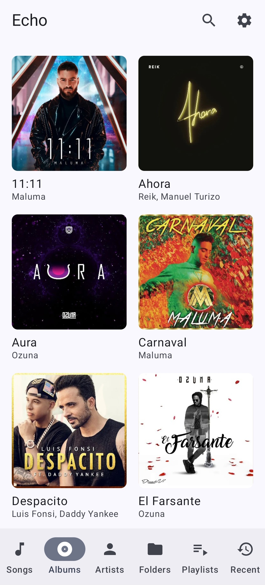
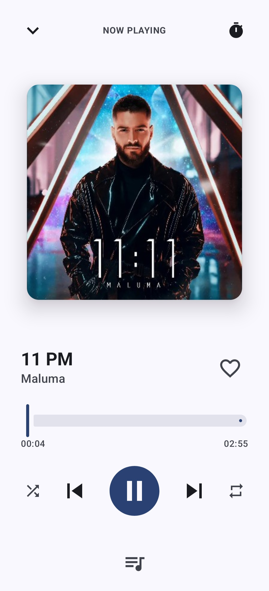
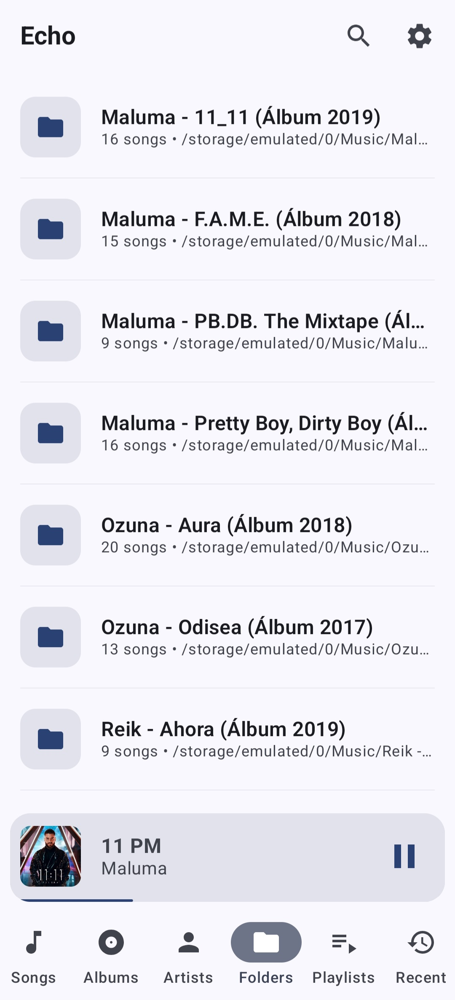

# Echo

A modern, high-performance local music player for Android. Echo provides a clean and pleasant listening experience for music stored directly on your device, prioritizing speed, privacy, and Material 3 design.

## Overview

Echo is built from the ground up using Jetpack Compose and modern Android architecture. It aims to be a focused alternative to bloated media players, offering robust library management and professional audio customization without unnecessary tracking or cloud dependencies.

## Features (v1.0.0)

### Core Playback
*   **High-Fidelity Audio**: Powered by Jetpack Media3 (ExoPlayer) for reliable background playback.
*   **Seamless Transitions**: Support for **True Gapless Playback** and customizable **Cross-fade** duration.
*   **Media Session Integration**: Full support for system-level controls, Bluetooth peripherals, and Android Auto.
*   **Interactive Controls**: Precision seeking, volume management, and instant skip controls.

### Library & Discovery
*   **Hierarchical Browsing**: Organize your collection by **Songs**, **Albums**, **Artists**, **Genres**, or **Folders**.
*   **Reactive Library**: Real-time synchronization with the Android system; the library updates instantly when music is added or removed from the device.
*   **Batch Management**: Efficiently manage your library with **Multi-Select** support and batch actions for playlists, the playback queue, and **Metadata Editing**.
*   **Smart Discovery**: Dynamic "Most Played" and "Recently Added" collections that adapt to your habits.
*   **Instant Search**: Real-time filtering across your entire library with immediate playback support.
*   **Search Intelligence**: Persistent **Search History** with interactive suggestions and one-tap filtering.
*   **User Collections**: Create and manage custom **Playlists** and keep track of your **Favorites**.
*   **Listening History**: Automatic tracking of your recently played tracks with manual management.
*   **Library Control**: Take command of your collection by excluding specific folders (e.g., voice notes, notifications) from being scanned.
*   **Metadata Editor**: In-app support for editing song information (Title, Artist, Album) and personalizing **Album Artwork**; includes **Batch Editing** for multiple tracks.

### Advanced Customization
*   **Adaptive UI**: Responsive layouts optimized for **Phones**, **Tablets**, and **Foldables** using Window Size Classes.
*   **Visual Fluidity**: Premium experience with **Shared Element Transitions** that provide visual continuity during navigation.
*   **Interactive Queue**: Manage upcoming tracks via a dedicated Bottom Sheet with **drag-and-drop reordering**.
*   **Professional Audio**: Built-in **5-band Equalizer** with frequency adjustment, **Presets**, and persistent audio profiles; includes **Volume Normalization** (DynamicsProcessing) for a balanced acoustic experience.
*   **Automation**: Integrated **Sleep Timer** with customizable intervals to automatically stop playback.
*   **Synchronized Lyrics**: Support for both embedded and external `.lrc` sidecar files with reactive, auto-scrolling display.
*   **Dynamic UI**: Full support for **Light/Dark/System** modes and **Material You Dynamic Color** (Android 12+).
*   **Ambient Presence**: Quick access via **Static and Dynamic Launcher Shortcuts** for Search, Shuffle All, and your most-played playlists.
*   **Home Screen Widget**: Control your music instantly using a modern Jetpack Glance widget.

## Screenshots

  
  
  
  

## Requirements

*   **Android Device**: Running Android 7.0 (API level 24) or higher.
*   **Storage Access**: Permission to read audio files from device storage.

## Getting Started

1.  **Clone the repository**: `git clone https://github.com/acevflow/Echo.git`
2.  **Open in Android Studio**: Selection the root folder.
3.  **Build & Run**: Use the `app` configuration.

For more detailed instructions, see the [Build & Installation guide](docs/build.md).

## Development

Echo is developed with a strict adherence to **Clean Architecture** principles, ensuring the codebase remains modular, testable, and maintainable. The project includes a robust **Unit Testing** suite using MockK and Turbine to guarantee the integrity of reactive data streams.

## Documentation

- [**Architecture**](docs/architecture.md) - Learn about the Clean Architecture implementation.
- [**Media Playback**](docs/media-playback.md) - Details on Media3, Equalizer, and Queue management.
- [**Permissions**](docs/permissions.md) - Information on required Android permissions and data access.

## Technical Stack
*   **UI**: Jetpack Compose (Material 3, Window Size Classes & Shared Element Transitions)
*   **Logic**: Kotlin Coroutines, Flow, **MockK** & **Turbine** (Testing)
*   **DI**: Dagger Hilt
*   **Database**: Room (Relational persistence)
*   **Settings**: Jetpack DataStore (Reactive preferences)
*   **Media**: Jetpack Media3 (Audio engine & Session)
*   **Performance**: Baseline Profiles (androidx.profileinstaller)
*   **Widget**: Jetpack Glance
*   **Image Loading**: Coil

## Roadmap

### Next Release
- [ ] **Performance Profiling**: Comprehensive benchmarking using Macrobenchmark and Baseline Profile optimization.
- [ ] **Visual Polish**: Animated artwork effects and custom transition curves.
- [ ] **Enhanced Discovery**: Personal year-in-review and advanced library statistics.

### Future
- [ ] **Cloud Sync**: Optional, privacy-focused synchronization of playlists and favorites.
- [ ] **Wear OS Support**: Companion app for music control from your wrist.

## Contributing

Contributions are welcome! Please review our [CONTRIBUTING.md](CONTRIBUTING.md) to get started.

## Security

We take user privacy and security seriously. Please report vulnerabilities as described in [SECURITY.md](SECURITY.md).

## License

Echo is released under the [MIT License](LICENSE).
